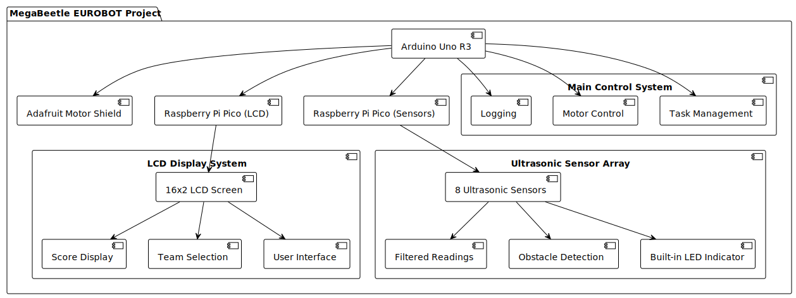

# MegaBeetle EUROBOT Project

This repository contains the comprehensive code and necessary documentation for the MegaBeetle robot designed for the Eurobot competition. The primary objective is to build a robot capable of transporting plants from one designated area to another while avoiding collisions with the opposing team's robot.

## Project Overview

The MegaBeetle robot is composed of three primary modules, each performing distinct roles to ensure the robot functions effectively during the competition. The provided image outlines the structure and interaction of these modules.

### Main Control System on Arduino Uno R3

Located in the `MainArduino` directory, the Arduino Uno R3 serves as the brain of the MegaBeetle robot, controlling its movements through mecanum wheels. An Adafruit Motor Shield is used to interface with the motors, providing the necessary drive capabilities for the mecanum wheels to achieve omnidirectional movement.

- **Motor Control**: The Adafruit Motor Shield drives the motors, enabling precise control over speed and direction for each wheel.
- **Task Management**: The system uses a task queue to manage movement commands, allowing for complex navigation patterns.
- **Logging**: Structured logging via the Serial interface provides detailed information about the robot's internal state and events, aiding in debugging and performance monitoring.

### LCD Display System on Raspberry Pi Pico

Located in the `lcd_screen` directory, the Raspberry Pi Pico controls a 16x2 LCD screen that displays the robot's score and allows team selection. This module is critical for meeting competition requirements to display real-time scores and facilitating user interaction.

- **Score Display**: Display of the score of the match.
- **Team Selection**: Interactive menu for selecting the team color (blue or yellow) and setting the score.
- **User Interface**: Uses buttons for navigating menus and adjusting the score.

### Ultrasonic Sensor Array on Raspberry Pi Pico

Located in the `UltraSonicSensors` directory, this module handles distance measurements using an array of ultrasonic sensors to detect obstacles and set corresponding flags. It plays a crucial role in the robot's ability to navigate the competition field safely.

- **Multiple Sensors**: Reads distance data from 8 ultrasonic sensors placed around the robot.
- **Filtered Readings**: Implements a filtering mechanism to ignore false readings and ensure reliable distance measurements.
- **Obstacle Detection**: Sets output flags when obstacles are detected within a specified threshold distance, triggering appropriate responses.
- **Built-in LED Indicator**: Activates the built-in LED if any of the flags are set, providing a visual indication of detected obstacles.

## Installation and Setup

### Main Arduino Code

1. **Install the Required Libraries**: Ensure you have the necessary libraries (`util/atomic.h`, `Adafruit_MotorShield`, `PinChangeInterrupt`, `ArxContainer`) installed in the Arduino IDE.
2. **Upload the Code**: Upload the `main.ino` in the `MainArduino` directory to the Arduino Uno R3.

### LCD Screen Code

1. **Setup Instructions**: Refer to the `lcd_screen/README.md` for detailed setup instructions.
2. **Upload the Code**: Use the provided `CMakeLists.txt` to configure and upload the code to the Raspberry Pi Pico.

### Ultrasonic Sensor Code

1. **Setup Instructions**: Refer to the `UltraSonicSensors/README.md` for detailed setup instructions.
2. **Upload the Code**: You can also use the Arduino IDE to upload the `ultra_sonic_the_hedge_hog.ino` in the `UltraSonicSensors` directory to the Raspberry Pi Pico.

By following these instructions, you will set up the MegaBeetle robot for the Eurobot competition, ensuring it is ready to perform effectively during the match.
